## Goals of this Lesson

### Students will learn:

1. How to generate beautiful statistical visualizations in Python using the `seaborn` package

## Links to Files and Video Recording

The files for all tutorials can be downloaded from [the Columbia Psychology Scientific Computing GitHub page](https://github.com/cu-psych-computing/cu-psych-comp-tutorial) using [these instructions](/accessing-files/). This particular file is located here: `/content/tutorials/python/4-plotting/index.ipynb`.

For a video recording of this tutorial from the Fall 2020 workshop, please visit the <a href="/workshop-recording/session3/" target="_blank">Workshop Recording: Session 3</a> page.


```python
# load packages we will be using for this lesson
import pandas as pd
import seaborn as sns
import warnings
warnings.filterwarnings('ignore')

sns.set(rc={'figure.figsize':(12,8)})
```

---
## Load in Sample Data
We’re going to practice here on a dataset from the 1990 NHANES (National Health and Nutrition Examination Survey). The variables are below:

- Region - Geographic region in the USA: Northeast (1), Midwest (2), South (3), and West (4)
- Sex - Biological sex: Male (1), Female (2)
- Age - Age measured in months (we’ll convert this to years below)
- Urban - Residential population density: Metropolital Area (1), Other (2)
- Weight - Weight in pounds
- Height - Height in inches
- BMI - BMI, measured in kg/(m^2)


```python
nhanes = pd.read_csv("NHANES1990.csv")
nhanes.head()
```


<div>
<style scoped>
    .dataframe tbody tr th:only-of-type {
        vertical-align: middle;
    }

    .dataframe tbody tr th {
        vertical-align: top;
    }

    .dataframe thead th {
        text-align: right;
    }
</style>
<table border="1" class="dataframe">
  <thead>
    <tr style="text-align: right;">
      <th></th>
      <th>Region</th>
      <th>Sex</th>
      <th>Age</th>
      <th>Urban</th>
      <th>Weight</th>
      <th>Height</th>
      <th>BMI</th>
    </tr>
  </thead>
  <tbody>
    <tr>
      <th>0</th>
      <td>3</td>
      <td>2</td>
      <td>513</td>
      <td>2</td>
      <td>171.7</td>
      <td>65.3</td>
      <td>28.4</td>
    </tr>
    <tr>
      <th>1</th>
      <td>4</td>
      <td>1</td>
      <td>307</td>
      <td>2</td>
      <td>155.2</td>
      <td>62.3</td>
      <td>28.2</td>
    </tr>
    <tr>
      <th>2</th>
      <td>4</td>
      <td>2</td>
      <td>886</td>
      <td>1</td>
      <td>166.7</td>
      <td>59.2</td>
      <td>33.5</td>
    </tr>
    <tr>
      <th>3</th>
      <td>4</td>
      <td>1</td>
      <td>458</td>
      <td>1</td>
      <td>224.7</td>
      <td>71.9</td>
      <td>30.6</td>
    </tr>
    <tr>
      <th>4</th>
      <td>2</td>
      <td>1</td>
      <td>888</td>
      <td>2</td>
      <td>245.0</td>
      <td>67.7</td>
      <td>37.6</td>
    </tr>
  </tbody>
</table>
</div>


First, let's clean up the data a little bit:


```python
nhanes['Age'] = nhanes['Age']/12
nhanes['Urban'] = nhanes['Urban'].replace({1:'Metro Area',2:'Non-Metro Area'})
nhanes['Region'] = nhanes['Region'].replace({1:'Northeast',2:'Midwest',3:'South',4:'West'})
```


```python
nhanes.head()
```


<div>
<style scoped>
    .dataframe tbody tr th:only-of-type {
        vertical-align: middle;
    }

    .dataframe tbody tr th {
        vertical-align: top;
    }

    .dataframe thead th {
        text-align: right;
    }
</style>
<table border="1" class="dataframe">
  <thead>
    <tr style="text-align: right;">
      <th></th>
      <th>Region</th>
      <th>Sex</th>
      <th>Age</th>
      <th>Urban</th>
      <th>Weight</th>
      <th>Height</th>
      <th>BMI</th>
    </tr>
  </thead>
  <tbody>
    <tr>
      <th>0</th>
      <td>South</td>
      <td>2</td>
      <td>42.750000</td>
      <td>Non-Metro Area</td>
      <td>171.7</td>
      <td>65.3</td>
      <td>28.4</td>
    </tr>
    <tr>
      <th>1</th>
      <td>West</td>
      <td>1</td>
      <td>25.583333</td>
      <td>Non-Metro Area</td>
      <td>155.2</td>
      <td>62.3</td>
      <td>28.2</td>
    </tr>
    <tr>
      <th>2</th>
      <td>West</td>
      <td>2</td>
      <td>73.833333</td>
      <td>Metro Area</td>
      <td>166.7</td>
      <td>59.2</td>
      <td>33.5</td>
    </tr>
    <tr>
      <th>3</th>
      <td>West</td>
      <td>1</td>
      <td>38.166667</td>
      <td>Metro Area</td>
      <td>224.7</td>
      <td>71.9</td>
      <td>30.6</td>
    </tr>
    <tr>
      <th>4</th>
      <td>Midwest</td>
      <td>1</td>
      <td>74.000000</td>
      <td>Non-Metro Area</td>
      <td>245.0</td>
      <td>67.7</td>
      <td>37.6</td>
    </tr>
  </tbody>
</table>
</div>


---
## Scatter Plots

`seaborn` makes creating attractive and publication-quality data visualizations possible with single line commands. We'll start with a scatter plot to look at how some of our variables are distributed by using the `scatterplot()` function.


```python
sns.scatterplot(x="Age",y="Weight",data=nhanes);
```


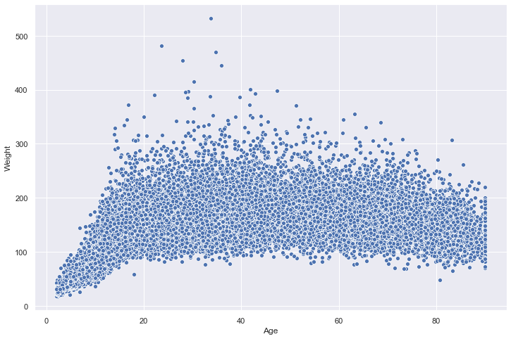


We can also easily represent other dimensions of the data on this place using the `size` of the points. Let's map that to `BMI`:


```python
sns.scatterplot(x="Age",y="Weight",data=nhanes,size="BMI");
```


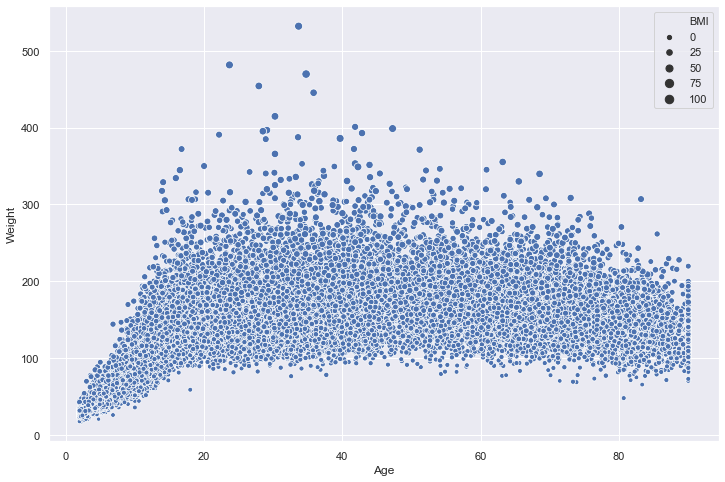


We can even add a fourth dimension to this visualization by mapping the color of the points to a categorial variable. Let's now use the `hue` argument to represent each point based on whether it is urban or non-urban:


```python
sns.scatterplot(x="Age",y="Weight",data=nhanes,size="BMI",hue="Urban");
```


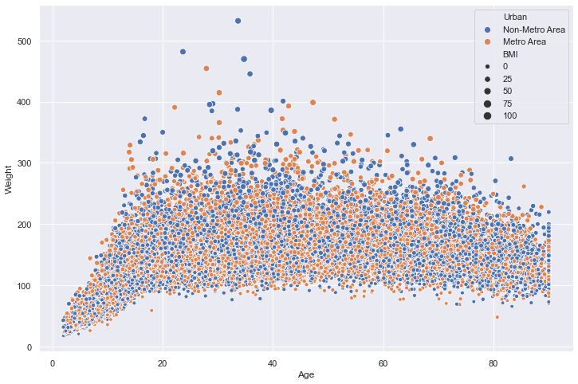


There are lots of ways you can vary and customize this visualization using `seaborn`. The package is very well documented and you can check out references with examples for all functions here: https://seaborn.pydata.org/api.html.


---
## Histograms and Data Distributions

We can use the `distplot()` function to look at both a histogram and an smoothed estimate of the data distribution.


```python
sns.distplot(nhanes["Weight"]);
```


If we want to look at only a histogram, we can just set the `kde` argument to `False`:


```python
sns.distplot(nhanes["Weight"],kde=False);
```


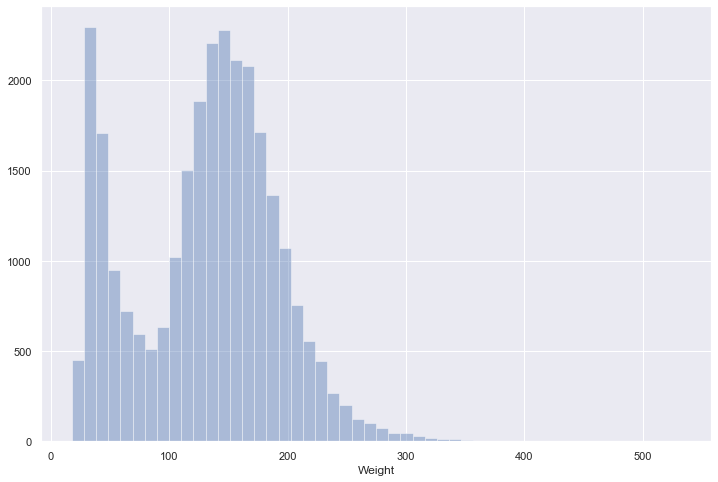


---
## Jointplots
`seaborn` also has some quick ways to combine both the univariate histogram/density plots and scatter plots from above using `jointplot()`. By default, this fucntion will plot a scatter plot and a histogram for two continuous x and y variables:


```python
sns.jointplot(x="Age",y="Weight",data=nhanes);
```


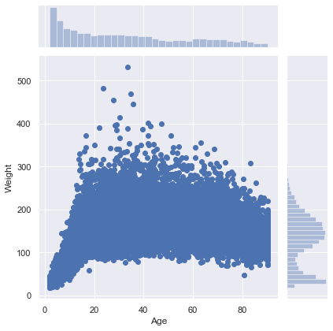


We can also modify it to plot density estimates using the `kind` keyword:


```python
sns.jointplot(x="Age",y="Weight",data=nhanes,kind="kde");
```


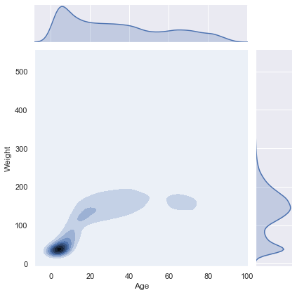


---
## Categorical Plots

The plot types above are great for visualizing continuous x continuous data, but there are better ways to look at continuous x categorical data. For example, what if we want to look at the distribution of weights by region?

One way of doing this is by using the `catplot()` function. By default, this function will plot each data point grouped by our categorical variable with some jittering to help us differentiate points:


```python
sns.catplot(x="Urban",y="Weight",data=nhanes,height=10);
```


It's kind of hard to see how the data is distributed because it is so dense, so let's change the size of the points using the `s` argument as well as the `alpha` value of each point to help with this:


```python
sns.catplot(x="Urban",y="Weight",data=nhanes,height=10,s=2,alpha=0.2);
```


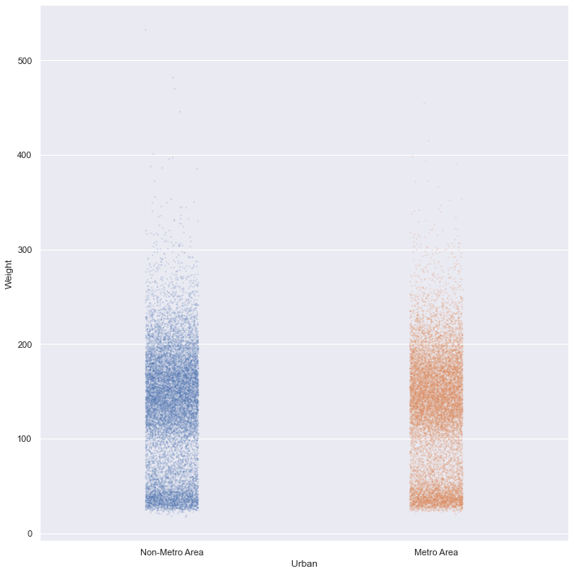


### Categorial summary plots

There's still a lot of data here, so it might be easier to visualize this distribution using a summary tool. Fortunately, `catplot()` makes it easy to change the type of plot by using the `kind` argument. We can change this plot to a traditional box and whisker plot:


```python
sns.catplot(x="Urban",y="Weight",data=nhanes,height=10,kind="box");
```


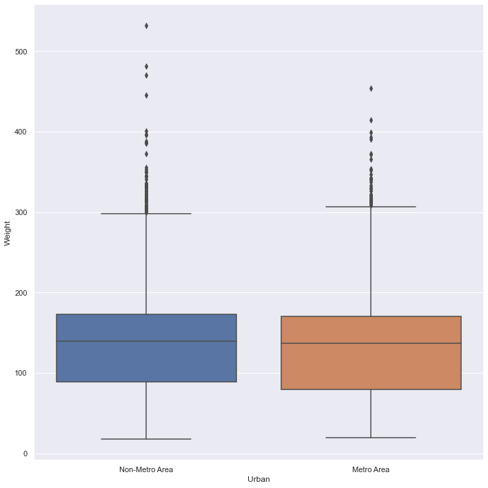


...or also more modern variations like a violin plot:


```python
sns.catplot(x="Urban",y="Weight",data=nhanes,height=10,kind="violin");
```


Now we can really get a sense of how the weight variable is distributed by urban area.

Sometimes, particularly when there are many levels in your categorical variable, it's a lot easier to plot only the summary without much information about how the data is distributed. We can set `kind` equal to `point` in order to do this:


```python
sns.catplot(x="Region",y="Weight",data=nhanes,aspect=2,kind="point",join=False);
```


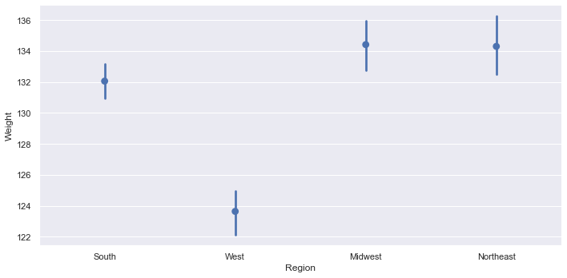


Note that `seaborn` automatically calculates bootstrapped 95% confidence intervals in the representation of uncertainty on this plot.

What if we wanted to put both of these plots on top of each other? `seaborn` has each of the plot types in `catplot()` as individual functions (e.g., `pointplot()` and `stripplot()`). We can just use both of these functions to plot one on top of the other:


```python
sns.barplot(x="Urban",y="Weight",data=nhanes)
sns.stripplot(x="Urban",y="Weight",data=nhanes,s=2,alpha=0.2);
```


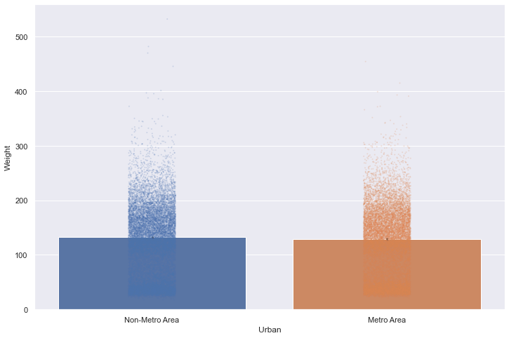


---
## Fitting Linear Models to the Data

Let's say we think there might be a linear relationship between height and weight. We can use the `lmplot()` function to fit and visualize a line. By default, `seaborn` will use a 95% confidence interval on this line.


```python
sns.lmplot(x="Height",y="Weight",data=nhanes,height=8,scatter_kws={'s':2,'alpha':0.1});
```


This model looks like it's extending a bit far beyond our actual data points. If we want to constrain the fit to only the the boundaries of our data, we can use the `truncate` argument:


```python
sns.lmplot(x="Height",y="Weight",data=nhanes,height=8,scatter_kws={'s':2,'alpha':0.1},
           truncate=True);
```


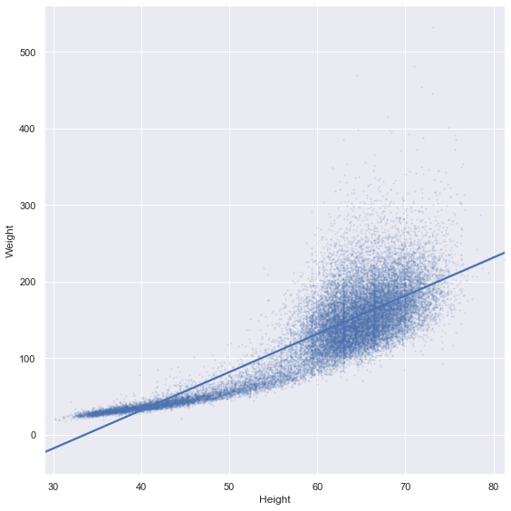


We might also want to break this relationship out by one of our categorical variables. We can do this by using either the `col` or `row` arguments:


```python
sns.lmplot(x="Height",y="Weight",data=nhanes,height=8,scatter_kws={'s':2,'alpha':0.1},
           truncate=True,col="Region",col_wrap=2);
```


We can further differentiate by color as well:


```python
sns.lmplot(x="Height",y="Weight",data=nhanes,height=8,scatter_kws={'s':2,'alpha':0.1},
           truncate=True,col="Region",col_wrap=2,hue="Region");
```


We can also combine `col` with `row` to represent both of our categorical variables:


```python
sns.lmplot(x="Height",y="Weight",data=nhanes,height=8,scatter_kws={'s':2,'alpha':0.1},
           truncate=True,col="Urban",row="Region",hue="Region");
```


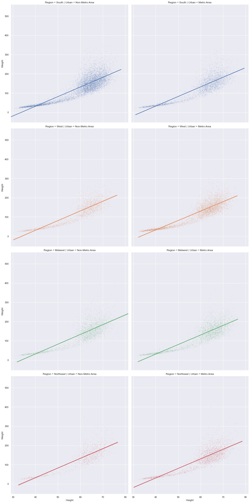


---
## Style

You might want to change the default style of plots. `seaborn` makes it easy to set style preferences for all of the plots in your notebook or script using the `set` function.


```python
help(sns.set)
```

    Help on function set in module seaborn.rcmod:
    
    set(context='notebook', style='darkgrid', palette='deep', font='sans-serif', font_scale=1, color_codes=True, rc=None)
        Set aesthetic parameters in one step.
        
        Each set of parameters can be set directly or temporarily, see the
        referenced functions below for more information.
        
        Parameters
        ----------
        context : string or dict
            Plotting context parameters, see :func:`plotting_context`
        style : string or dict
            Axes style parameters, see :func:`axes_style`
        palette : string or sequence
            Color palette, see :func:`color_palette`
        font : string
            Font family, see matplotlib font manager.
        font_scale : float, optional
            Separate scaling factor to independently scale the size of the
            font elements.
        color_codes : bool
            If ``True`` and ``palette`` is a seaborn palette, remap the shorthand
            color codes (e.g. "b", "g", "r", etc.) to the colors from this palette.
        rc : dict or None
            Dictionary of rc parameter mappings to override the above.
    


```python
sns.set(style="whitegrid",font="Arial",palette="Set1",font_scale=2)

sns.scatterplot(x="Height",y="Weight",hue="Urban",data=nhanes);
```


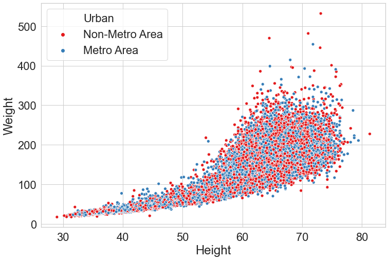


```python
sns.set(style="dark",palette="Set2")
sns.scatterplot(x="Height",y="Weight",hue="Urban",data=nhanes);
```


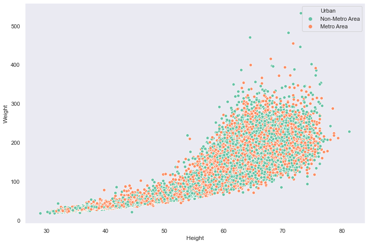


Personally, I like to use the `ticks` style, and the `Arial` font, but there are many options you can choose from. You can also use the `despine()` function to remove borders from the plot


```python
sns.set(style="ticks",font="Arial",palette="Pastel1",font_scale=2)
sns.scatterplot(x="Height",y="Weight",hue="Urban",data=nhanes);
sns.despine();
```


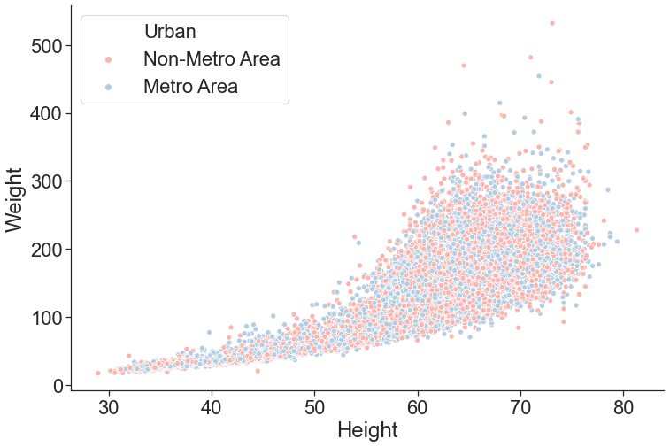


---
## Titles and Labels

In order to add a title and create more informative labels, we need to save the plot as an object using the `=` operator. We can then call the `set_{title,ylabel,xlabel}()` functions of this object to make the plots clearer.


```python
myPlot = sns.scatterplot(x="Height",y="Weight",hue="Urban",data=nhanes);
myPlot.set_title("Height and Weight by Urban Status")
myPlot.set_ylabel("Weight in pounds")
myPlot.set_xlabel("Height in inches")
sns.despine();
```


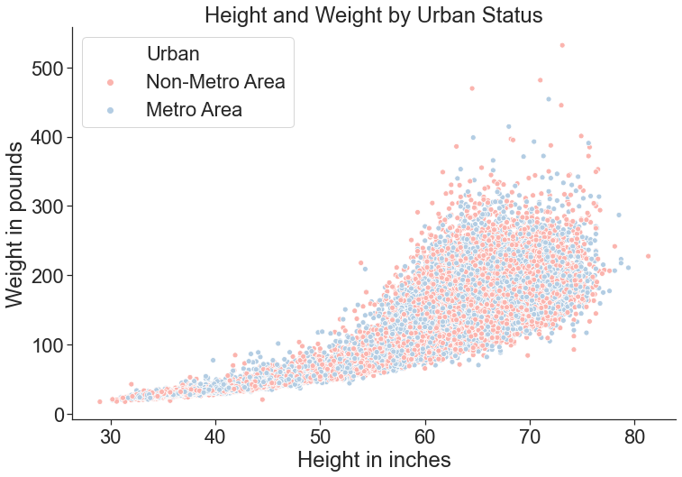


---
## Saving Your Plots

To save your plot as a file, you can access the `savefig()` function from your plot object:


```python
myPlot.figure.savefig("newPlotTest.pdf")
```

You can save plots in a variety of formats (like .jpg or .png) but using a vector format like .pdf or .svg is recommended.

---
## Heatmaps

Sometimes a heatmap might be useful to look at the value of one variable based on a 2D grid of two other variables.

This is kind of a silly example, but say we wanted to map out the number of observations in our dataset as a factor of region and neighborhood type:


```python
nhanesGroup = nhanes.groupby(["Region","Urban"]).size().reset_index(name="Observations")
nhanesGroup = nhanesGroup.pivot(index="Region",columns="Urban",values="Observations")
sns.heatmap(nhanesGroup);
```


---
## Time Series Plot

Let's make up some data on the prices of two different items from 1978-2017:


```python
import numpy as np

priceData = []
for i in range(10):
    years = range(1978,2018)
    item1 = np.random.normal(100,5,40)
    item2 = range(1,41) + np.random.normal(100,5,40)
    priceData.append(pd.DataFrame({'years':years,'item1':item1,'item2':item2}))
priceData = pd.concat(priceData).reset_index()   
priceData = pd.melt(priceData,id_vars=['years'],var_name="item",value_vars=['item1','item2'],value_name="price")
priceData.to_csv("priceData.csv")
```

To save some time, I already generated this data. You can go ahead and load it from a .csv file:


```python
priceData = pd.read_csv("priceData.csv")
```

The function `lineplot()` can be used to visualize time series data using `seaborn`.  Its syntax is exactly like plots we've used above. In addition, this function automatically calculates 95% confidence intervals around each of our datapoints and displays them as a continuous ribbon around the mean line: 


```python
sns.lineplot(x="years",y="price",hue="item",data=priceData)
sns.despine();
```


---
## Final Points

While `seaborn` will get you very far, sometimes you might want to do something it doesn't allow for. Fortunately, `seaborn` is written on top of a more robust (but less high-level and user friendly) package called `matplotlib`, which is the backbone behind plotting data in Python. While beyond the scope of this tutorial, you can read more about `matplotlib` here: https://matplotlib.org/ 
